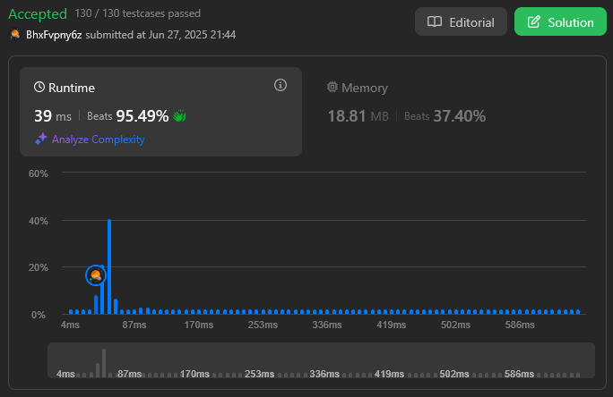
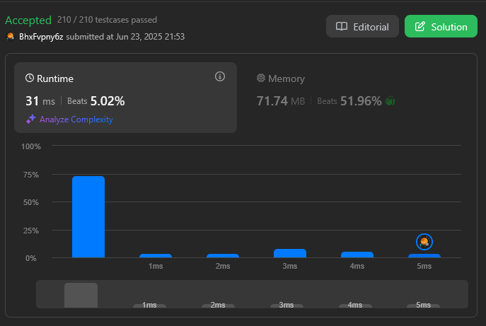
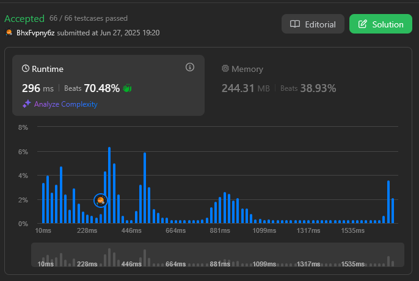
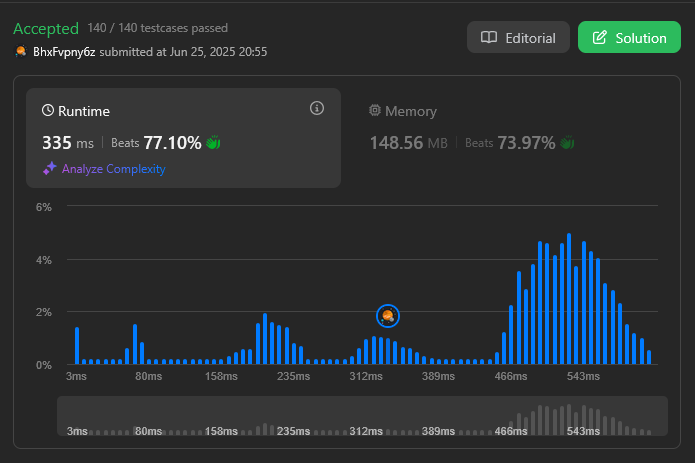

# MergeMasters

**Conteúdo da Disciplina**: Divisão e Conquista 

## Alunos
|Matrícula | Aluno |
| -- | -- |
| 22/1022014  |  João Vitor Lopes Ribeiro |
| 18/0066161  |  Luis Henrique Luz Costa |

## Sobre 
A entrega desse Trabalho de Divisão e Conquista da disciplina de Projeto de Algoritmos consiste em uma seleção de questões no leetcode de divisão e conquista de dificuldade média e difícil.

| Questão | Dificuldade |
|---------|-------------|
| [Search a 2D Matrix II](https://leetcode.com/problems/search-a-2d-matrix-ii/description/) | Média |
| [Maximum Subarray](https://leetcode.com/problems/maximum-subarray/description/) | Média |
| [Count of Smaller Numbers After Self](https://leetcode.com/problems/count-of-smaller-numbers-after-self/description/) | Difícil |
| [Reverse Pairs](https://leetcode.com/problems/reverse-pairs/description/) | Difícil |

## Screenshots

### [Search a 2D Matrix II](https://leetcode.com/problems/search-a-2d-matrix-ii/description/)

### [Maximum Subarray](https://leetcode.com/problems/maximum-subarray/description/)

### [Count of Smaller Numbers After Self](https://leetcode.com/problems/count-of-smaller-numbers-after-self/description/)

### [Reverse Pairs](https://leetcode.com/problems/reverse-pairs/description/)

## Instalação 
**Linguagem**: C++ 

Os códigos foram feitos para solucionar os problemas na plataforma Leetcode, portanto é necessário ter uma conta na plataforma.

## Uso 

1. Faça Sign In na plataforma Leetcode;
2. Copie o código de solução do problema do repositório; 
3. Acesse a página do problema;
4. Cole o código no editor do Leetcode;
5. Submeta o código;
6. Receba o resultado do teste do código sob as entradas do problema.

## Entregas 
[Entrega - Divisão e Conquista (Acessar o vídeo)]()
